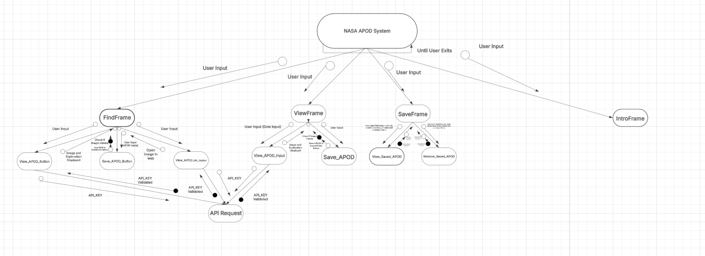
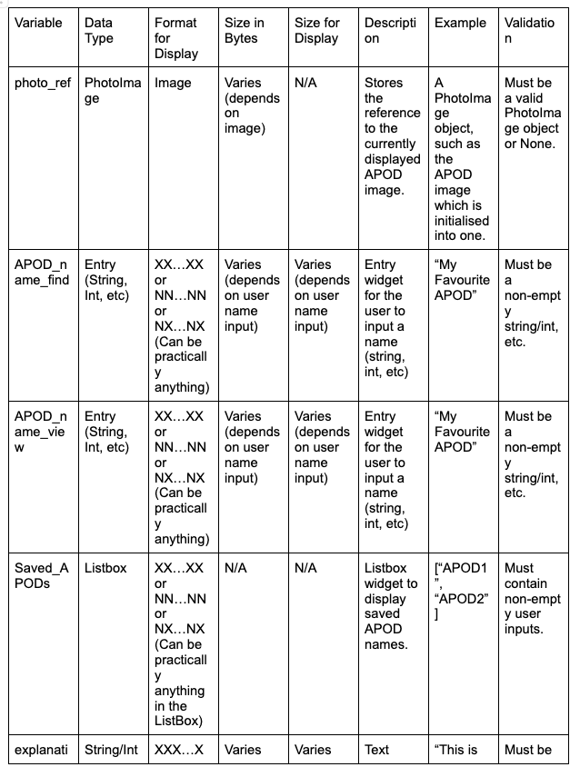
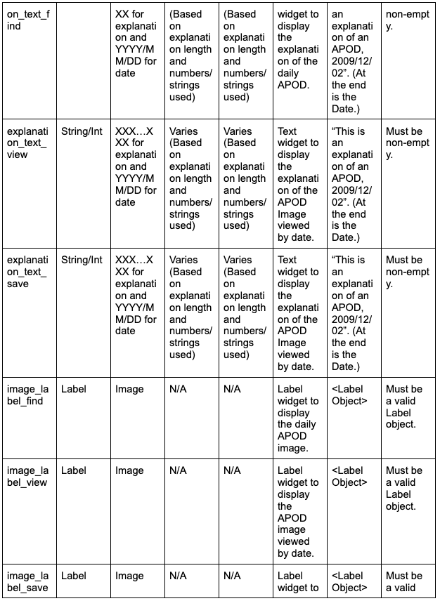
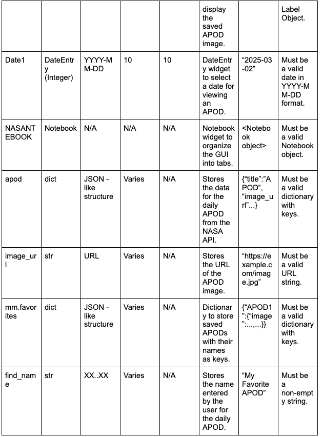
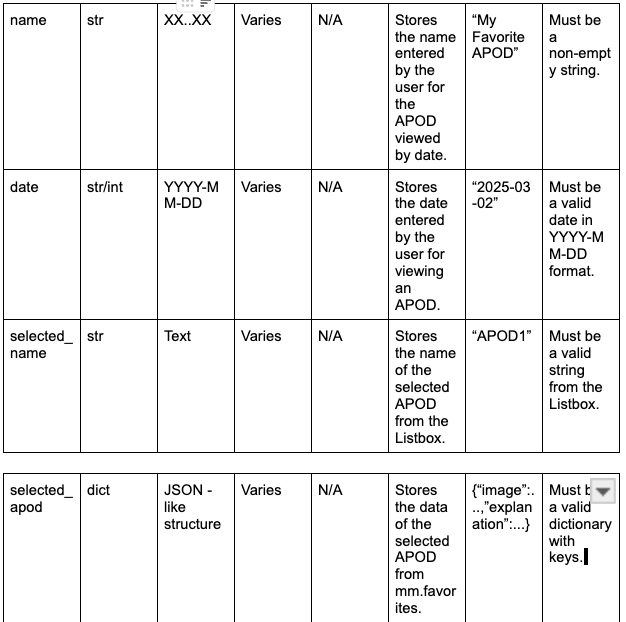

# Preliminary Software Engineering Assessment Task 1

***

## Requirements Definition

***

### Functional Requirements

**Data Retrieval: What does the user need to be able to view in the system?**

- A: User must be able to view images from any future chosen NASA API, as well as the information, date, and URL of that NASA image, as well as any external information that the user may want to know.

**User Interface: What is required for the user to interact with the system?**

- A: The user must have the NASA API installed, as well as any python functions in the requirements.txt file at the latest version, to access the information displayed in either GUI or Text Based format.

**Data Display: What information does the user need to obtain from the system?**

- A: Information could include NASA APOD images, Earth Imaging, Mars Rover Photos/Weather and Near Earth Object Services.

***

### Non-Functional Requirements

**Performance: How well does the system need to perform?**

- A: The system must be able to complete basic operations in under 10 seconds, including displaying certain images of APODS and must be able to give access to the user in saving certain information.

**Reliability: How reliable does the system and data need to be?**

- A: As the information derived is specifically space related, the system and data must be specifically from NASA, the most notable organisation I can think of.

**Usability and Accessibility: How easy to navigate does the system need to be? What instructions will we need for users to access the system?**

- A: The system should be relatively easy to navigate, as it will most probably be GUI based leading to a quick and easy access of the data. Following the information in the README, cloning the repository and then installing any of the python commands in the requirements file will allow for accessing the system.

***

### Functional Specifications

**User Requirements - What does the user need to be able to do? List all specifications here.**

- A: User must be able to:

1. View any NASA images from the API's chosen.

2. Be able to save and remove these images to a favourites list and the information related with it. 

3. If any graphs are involved, they should be able to view them in matplotlib graphs and furthermore save them to a list.

**Inputs & Outputs - What inputs will the system need to accept and what outputs will it need to display?**

- A: Inputs and Ouputs accepted and displayed would be:

1. Must accept input of a mouse click on a button in the GUI, it will display any information, images, or graphs regarding that mouse click in that position.

2. If it is text based, it should be able to accept integers as an input such as option 1, option 2, etc. It would then output the image in a pywebview function tab, and the related information would also be outputted with the corresponding information of saving any data.

**Core Features - At its core, what specifically does the program need to be able to do?**

- A: The program must be able to read data from any chosen NASA API and output that information to the user, with the option of saving the data and viewing it on a later date if necessary.

**User Interaction - How will users interact with the system (e.g. command-line, GUI?) and what information will it need to provide to help users navigate?**

- A: Either command-line or GUI, it should be able to provide choices such as option 1 etc for text based, and for GUI must be able to depict any tabs for viewing certain information such as graphs in a seperate tab, saved information, daily APOD, etc.

**Error Handling - What possible errors could you face that need to be handled by the system?**

- A: Possibly the images may not render in the GUI due to network issues or the NASA API in general. To combat this, I make custom error messages in relation to those problems and suggest fixes for the problem at hand.

***

### Non-Functional Specifications

**Performance - How quickly should we try to get the system to perform tasks, what efficiency is required to maintain user engagement? How can we ensure our program remains efficient?**

- A: Under 10 seconds of loading time for an image and the text will suffice for user engagement. Keeping the code clean and using functions and loops will allow for the peak efficiency of the program.

**Usability / Accessibility - How might you make your application more accessible? What could you do with the User Interface to improve usability?**

- A: Use a notebook function in the GUI. By doing so, I can maximise accessibility and usability, as functions are easily viewable. 

**Reliability - What could perhaps not crash the whole system, but could be an issue and needs to be addressed? Data integrity? Duplicate data? API retrieval crash?**

- A: API retrieval may pose an issue, due to problems with the NASA API in general or network issues. As for any data issues, NASA will have the highest data integrity and duplicate data can be solved by preventing the idea of saving information twice in a list. Additionally, a name can be given to the data in order to sort the list.

***

### Use Case

Actor: User (Astronomer / Space Nerd)

Preconditions: Internet acess, NASA API's, Python Functions (Matplotlib, Tkinter, Pandas, Requests, Pillow,  etc.)

Main Flow:

1. Open System - User opens the GUI, revealing the options that can be made.

2. Search NASA Image/Information - User can find a NASA image or any information based on date or they can derive the newest or oldest API based on user preferences.

3. Save NASA Image/Information - User can save the image and the information corresponding to that in a list, giving it a custom name.

4. Visualise NASA Image/Information - User can visualise the image and the information next to that corresponding image, based on a call from the list they saved it in or by a certain date.

5. Remove Image/Information - User can remove the image and corresponding information through the date or the name they have given it in the list.

Postconditions: Image and Information is retrieved, stored, or removed successfully.

***

## Design

***

### Gantt Chart

***

### Structure Chart
- Link for the Structure Chart: https://lucid.app/lucidchart/4fa442b4-c20c-47bb-b0a6-0d82bf8ebd6c/edit?invitationId=inv_56e13952-b4da-4ceb-847f-882dd6c4d600

- Image: 

***

### Algorithms


***

### Data Dictionary
- Link for the Data Dictionary: https://docs.google.com/document/d/1pd_3o4khOgFJZ_VoCDkAaHMMozaAgS-jTSy6FWuxrEM/edit?usp=sharing




***

## Development

### 1. First Commit - Basic Text Based GUI

```python
import my_module as mm
import webbrowser

def display_menu():
    """Display the main menu."""
    print("\n=== NASA APOD Explorer ===")
    print("1. View Today's APOD")
    print("2. Add Today's APOD to Favorites")
    print("3. View Favorites")
    print("0. Exit")

def main():
    while True:
        display_menu()
        choice = input("\nEnter your choice (0-3): ")
        try:
            choice = int(choice)
            if choice == 0:
                print("Goodbye!")
                break

            elif choice == 1:
                apod = mm.get_apod()
                if apod:
                    print(f"\nTitle: {apod['title']}")
                    print(f"Date: {apod['date']}")
                    print(f"Explanation: {apod['explanation']}")
                    print(f"Image URL: {apod['image_url']}")
                    try:
                        webbrowser.open(apod['image_url'])
                    except Exception as e:
                        print(f"Could not open browser: {e}")

            elif choice == 2:
                apod = mm.get_apod()
                if apod:
                    name = input("Enter a name for this favorite: ")
                    mm.add_favorite(name, apod)
                    print(f"Added '{name}' to favorites!")

            elif choice == 3:
                if mm.favorites:
                    print("\nFavorites:")
                    for name, data in mm.favorites.items():
                        print(f"- {name}: {data['title']}")
                        print(f"  Date: {data['date']}")
                        print(f"  URL: {data['image_url']}")
                else:
                    print("No favorites yet!")

            else:
                print("Invalid choice. Please select 0-3.")

        except ValueError:
            print("Please enter a valid number.")

if __name__ == "__main__":

    main()
```
- Explanation: Created a simple text based GUI utilising the example NASA module.py in the Gitbook given.

### 2. Second Commit - Basic GUI with Tkinter (Still Errors)

``` python
import my_module as mm
import webbrowser
import tkinter as tk
from tkinter import ttk

apod = mm.get_apod()

root = tk.Tk()
root.title("NASA NERD GUIDE")
root.geometry("900x600")
root.config(bg="black")
    
NASANOTEBOOK = ttk.Notebook(root)
NASANOTEBOOK.pack(fill='both', expand=True)

makeframe = ttk.Frame(NASANOTEBOOK)
modelframe = ttk.Frame(NASANOTEBOOK)
dataframe = ttk.Frame(NASANOTEBOOK)
helpframe = ttk.Frame(NASANOTEBOOK)

NASANOTEBOOK.add(makeframe, text='Find an APOD!')
NASANOTEBOOK.add(modelframe, text='Save an APOD!')
NASANOTEBOOK.add(dataframe, text='View an APOD!')
NASANOTEBOOK.add(helpframe, text = 'Remove an APOD!')

def ButtonPushed():
     
    print(f"\nTitle: {apod['title']}")
    print(f"Date: {apod['date']}")
    print(f"Explanation: {apod['explanation']}")
    print(f"Image URL: {apod['image_url']}")
    try:
            webbrowser.open(apod['image_url'])
    except Exception as e:
        print(f"Could not open browser: {e}")

Button = tk.Button(makeframe, text="View the Daily APOD!", command=lambda: ButtonPushed).pack()

root.mainloop()

```
- Explanation: Created a simple button pushing GUI to reveal an APOD in a webbrowser. I reused the notebook code from my previous data analysis project, as to why the notebook tab names are not NASA related. I did not find an error for this stage in development yet.

### 3. Third Commit - Basic GUI with Tkinter (Fixed)

``` python
from tkinter import ttk

apod = mm.get_apod()

root = tk.Tk()
root.title("NASA NERD GUIDE")
root.geometry("900x600")
root.config(bg="black")
def GUI():
    
NASANOTEBOOK = ttk.Notebook(root)
NASANOTEBOOK.pack(fill='both', expand=True)

makeframe = ttk.Frame(NASANOTEBOOK)
modelframe = ttk.Frame(NASANOTEBOOK)
dataframe = ttk.Frame(NASANOTEBOOK)
helpframe = ttk.Frame(NASANOTEBOOK)

NASANOTEBOOK.add(makeframe, text='Find an APOD!')
NASANOTEBOOK.add(modelframe, text='Save an APOD!')
NASANOTEBOOK.add(dataframe, text='View an APOD!')
NASANOTEBOOK.add(helpframe, text = 'Remove an APOD!')

def ButtonPushed():
     
    print(f"\nTitle: {apod['title']}")
    print(f"Date: {apod['date']}")
    print(f"Explanation: {apod['explanation']}")
    print(f"Image URL: {apod['image_url']}")
        root = tk.Tk()
        root.title("NASA NERD GUIDE")
        root.geometry("900x600")
        root.config(bg="black")
    
        NASANOTEBOOK = ttk.Notebook(root)
        NASANOTEBOOK.pack(fill='both', expand=True)

        makeframe = ttk.Frame(NASANOTEBOOK)
        modelframe = ttk.Frame(NASANOTEBOOK)
        dataframe = ttk.Frame(NASANOTEBOOK)
        helpframe = ttk.Frame(NASANOTEBOOK)

        NASANOTEBOOK.add(makeframe, text='Find an APOD!')
        NASANOTEBOOK.add(modelframe, text='Save an APOD!')
        NASANOTEBOOK.add(dataframe, text='View an APOD!')
        NASANOTEBOOK.add(helpframe, text = 'Remove an APOD!')

        Button = tk.Button(makeframe, text="View the Daily APOD!", command=Find_APOD_Button)
        Button.pack()

        root.mainloop()

def Find_APOD_Button():
    try:
            webbrowser.open(apod['image_url'])
        print(f"\nTitle: {apod['title']}")
        print(f"Date: {apod['date']}")
        print(f"Explanation: {apod['explanation']}")
        print(f"Image URL: {apod['image_url']}")
        webbrowser.open(apod['image_url'])
    except Exception as e:
        print(f"Could not open browser: {e}")
        print(f"Error: {e}")

GUI()

Button = tk.Button(makeframe, text="View the Daily APOD!", command=lambda: ButtonPushed).pack()


    

root.mainloop()

```
- Explanation: I fixed this and made it more simple for me to understand (I did not understand try and except yet) and I seperated the command from the button in the line, as one of my goals in my previous commit. I for some reason kept the old line after the GUI, but even so the code snippet would still work.

### 4. Fourth Commit - Worked on the View APOD Tab (I dont know why I called it the Save APOD Tab)

``` python
import my_module as mm
import webbrowser
import tkinter as tk
from tkinter import *
from tkinter import ttk


apod = mm.get_apod()

def GUI():
        
        global Save_Input

    
        root = tk.Tk()
        root.title("NASA NERD GUIDE")
def GUI():
        NASANOTEBOOK = ttk.Notebook(root)
        NASANOTEBOOK.pack(fill='both', expand=True)

        makeframe = ttk.Frame(NASANOTEBOOK)
        modelframe = ttk.Frame(NASANOTEBOOK)
        dataframe = ttk.Frame(NASANOTEBOOK)
        helpframe = ttk.Frame(NASANOTEBOOK)
        FindFrame = ttk.Frame(NASANOTEBOOK)
        SaveFrame = ttk.Frame(NASANOTEBOOK)
        ViewFrame = ttk.Frame(NASANOTEBOOK)
        RemoveFrame = ttk.Frame(NASANOTEBOOK)

        NASANOTEBOOK.add(FindFrame, text='Find an APOD!')
        NASANOTEBOOK.add(SaveFrame, text='Save an APOD!')
        NASANOTEBOOK.add(ViewFrame, text='View an APOD!')
        NASANOTEBOOK.add(RemoveFrame, text = 'Remove an APOD!')

        View_Button = tk.Button(FindFrame, text="View the Daily APOD!", command=Find_APOD_Button)
        View_Button.pack()


        Label(root, text="Enter a Date Of the APOD to Save It!").pack()

        NASANOTEBOOK.add(makeframe, text='Find an APOD!')
        NASANOTEBOOK.add(modelframe, text='Save an APOD!')
        NASANOTEBOOK.add(dataframe, text='View an APOD!')
        NASANOTEBOOK.add(helpframe, text = 'Remove an APOD!')
        Label(root, text="Date Input (YYYY-MM-DD)").pack()

        Save_Button = tk.Button(SaveFrame, text="Open Image!", command = Save_APOD_Input)
        Save_Button.pack()
        Save_Input = Entry(SaveFrame, bg= "black", fg= "white")
        Save_Input.pack()

        Button = tk.Button(makeframe, text="View the Daily APOD!", command=Find_APOD_Button)
        Button.pack()

        root.mainloop()


def Find_APOD_Button():
    try:
        print(f"\nTitle: {apod['title']}")
def Find_APOD_Button():
    except Exception as e:
        print(f"Error: {e}")

def Save_APOD_Input():
    
    global Save_Input

GUI()

```
- Explanation: A very messy and failed interpretation of this, even I cannot read it. This was unfinished, and will be depicted in the fifth commit.

### 5. Fifth Commit - Worked on the View APOD Tab (Fixed)

``` python
import my_module as mm
import tkinter as tk
from tkinter import *
from tkinter import ttk
import requests
import io
from PIL import Image, ImageTk

apod = mm.get_apod()

# Main GUI function
def GUI():
    global View_Input, image_label_find, find_image_frame, photo_ref, image_label_view
    
    root = tk.Tk()
    root.title("NASA NERD GUIDE")
    root.geometry("900x600")
    root.config(bg="black")
    style = ttk.Style()
    
    # Configure the Notebook style
    style.theme_use("default")  #
    style.configure("TNotebook", background="black", borderwidth=0)  
    style.configure("TNotebook.Tab", background="black", foreground="white", padding=[10, 5], borderwidth=0) 
    style.map("TNotebook.Tab", background=[("selected", "#1a1a1a"), ("active", "#333333")], foreground=[("selected", "white"), ("active", "white")])  # Tab states
    style.configure("TFrame", background="black") 
    
    # Create a Notebook (tabbed interface)
    NASANOTEBOOK = ttk.Notebook(root)
    NASANOTEBOOK.pack(fill='both', expand=True)


    # Create frames for each tab
    FindFrame = ttk.Frame(NASANOTEBOOK)
    ViewFrame = ttk.Frame(NASANOTEBOOK)
    SaveFrame = ttk.Frame(NASANOTEBOOK)
    RemoveFrame = ttk.Frame(NASANOTEBOOK)

    # Add tabs to the Notebook
    NASANOTEBOOK.add(FindFrame, text='Find an APOD!')
    NASANOTEBOOK.add(ViewFrame, text='View an APOD!')
    NASANOTEBOOK.add(SaveFrame, text='Save an APOD!')
    NASANOTEBOOK.add(RemoveFrame, text='Remove an APOD!')

    # Add frame to the FindFrame tab for the APOD image
    find_image_frame = Frame(FindFrame, bg="black")
    find_image_frame.pack(fill='both', expand=True, padx=10, pady=10)

    # Add an image label inside the frame for the APOD image
    image_label_find = Label(find_image_frame, bg="black")
    image_label_find.pack(pady=10)

    # ViewFrame Button to view the daily APOD
    View_Button = tk.Button(FindFrame, text="View the Daily APOD!", command=View_APOD_Button, fg="black", bg="black")
    View_Button.pack(pady=20)

    # Entry widget for date input
    View_Input = Entry(ViewFrame, bg="black", fg="white", insertbackground="white", font=("Arial", 12))
    View_Input.pack(pady=10)  # Add padding for spacing

    # Button to open the View Frame image
    View_Button = tk.Button(ViewFrame, text="Open Image!", command=View_APOD_Input)
    View_Button.pack(pady=10)

    # Add frame to the ViewFrame tab for the APOD image
    view_image_frame = Frame(ViewFrame, bg="black")
    view_image_frame.pack(fill='both', expand=True, padx=10, pady=10)

    #Add an image label inside the frame for the APOD image
    image_label_view = Label(view_image_frame, bg="black")
    image_label_view.pack(pady=10)

   
    photo_ref = None

    root.mainloop()

# Function to view the daily APOD
def View_APOD_Button():
    global image_label_find, image_url, photo_ref
    if apod is None:
        print("Failed to detch today's APOD.")
        image_label_find.config(image="", text="Failed to fetch APOD", fg="red")
        return
    try:
        image_url = apod['image_url']
        response = requests.get(image_url, timeout=10)
        response.raise_for_status()
        image_data = response.content
        image = Image.open(io.BytesIO(image_data))
        image = image.resize((min(image.width, 600), min(image.height, 400)), Image.LANCZOS)
        photo = ImageTk.PhotoImage(image)
        image_label_find.config(image=photo)
        image_label_find.photo = photo
        photo_ref = photo
    except Exception as e:
        print(f"Error loading image: {e}")
        image_label_find.config(image="", text=f"Error loading image: {e}", fg="red")

# Function to view APOD for the specified date
def View_APOD_Input():
    global View_Input, photo_ref, image_label_view
    date = View_Input.get()
    if date:
        try:
            apod_data = mm.get_apod(date)  
            if apod_data and 'image_url' in apod_data:
                image_url = apod_data['image_url']
                response = requests.get(image_url, timeout=10)
                response.raise_for_status()
                image_data = response.content
                image = Image.open(io.BytesIO(image_data))
                image = image.resize((min(image.width, 600), min(image.height, 400)), Image.LANCZOS)
                photo = ImageTk.PhotoImage(image)
                image_label_view.config(image=photo)
                image_label_view.photo = photo
                photo_ref = photo
            else:
                print("No image found for this date or failed to fetch APOD.")
        except Exception as e:
            print(f"Error fetching APOD for date {date}: {e}")
    else:
        print("Please enter a date in YYYY-MM-DD format.")

# Run the GUI
GUI()

```
- Explanation: A very long and lethargic commit, I did much research on how to fetch an APOD on a specific date, inside the GUI. This worked through the fact that I used numerous new modules (io, pillow, requests) to process the APOD image. I did this through getting the input of the date from the user as a parameter (which I added in the module), along with the get_apod function, and then initialising it with the requests module to retrieve the url with an HTTP request as well as checking if it was successful or not with the function response.raise_for_status(), then from the Pillow library to open the image for the binary data and following using a conversion technique utilised in Tkinter to make the processed image into a PhotoImage, a very long process but worthwhile due to the tolerance of good image quality, and then outputting it with the line image_label_view_config(image=photo), updating the wdiget in the GUI to display the new image. I also stored this image in a photo_ref variable for further use in the future such as saving it, which was one of my development plans. I did the same for the daily APOD without getting the date parameter from the user, and included some error handling as well.

### 6. Sixth Commit - Explanation Labels (Errors Present)

``` python
apod = mm.get_apod()

# Main GUI function
def GUI():
   
    global View_Input, image_label_find, find_image_frame, photo_ref, image_label_view, explanation_text_frame
    
    root = tk.Tk()
    root.title("NASA NERD GUIDE")
def GUI():
    View_Button = tk.Button(FindFrame, text="View the Daily APOD!", command=View_APOD_Button, fg="black", bg="black")
    View_Button.pack(pady=30)

    # Explanation label for the chosen APOD image
    explanation_text_frame = Label(FindFrame, bg="black")
    explanation_text_frame.pack(pady=10)

    # Label to explain the date input
    date_label = Label(ViewFrame, text="Enter a date in YYYY-MM-DD format:", bg="black", fg="white")
    date_label.pack(pady=10)

        print(f"Error loading image: {e}")
        image_label_find.config(image="", text=f"Error loading image: {e}", fg="red")

# Function to view title, explanation, date url of the chosen APOD in FindFrame
def Find_APOD_Explanation():
    global explanation_text_frame

# Function to view APOD for the specified date
def View_APOD_Input():
    global View_Input, photo_ref, image_label_view
    date = View_Input.get()
    if date:
        try:
            apod_data = mm.get_apod(date)  # Fetch APOD for the specified date
            if apod_data and 'image_url' in apod_data:
                image_url = apod_data['image_url']
                response = requests.get(image_url, timeout=10)
                response.raise_for_status()
                image_data = response.content
                image = Image.open(io.BytesIO(image_data))
                # Resize image to fit within a reasonable size)
                image = image.resize((min(image.width, 2000), min(image.height, 1000)), Image.LANCZOS)
                photo = ImageTk.PhotoImage(image)
                image_label_view.config(image=photo)
                image_label_view.photo = photo
                photo_ref = photo
            else:
                print("No image found for this date or failed to fetch APOD.")
        except Exception as e:
            print(f"Error fetching APOD for date {date}: {e}")
    else:
        print("Please enter a date in YYYY-MM-DD format.")

# Run the GUI
GUI()

```
- Explanation: I started working on explanation labels, meaning that the explanation would be viewable along with the image. The function was still unfinished, so there was not that much progress from the 5th Commit.

### 7. Seventh Commit - Explanation Labels (Fixed)

``` python
apod = mm.get_apod()

# Main GUI function
def GUI():
    
    global View_Input, image_label_find, find_image_frame, photo_ref, image_label_view, explanation_text_find, explanation_text_view
    global NASANOTEBOOK
    
    root = tk.Tk()
    root.title("NASA NERD GUIDE")
def GUI():
    View_Button = tk.Button(FindFrame, text="View the Daily APOD!", command=View_APOD_Button, fg="black", bg="black")
    View_Button.pack(pady=30)

    # Explanation, title, url text for the chosen APOD image
    explanation_text_find = Text(FindFrame, height=10, width=80, bg="black", fg="white", wrap="word", font=("Arial", 10))
    explanation_text_find.pack(pady=10)

    # Label to explain the date input
    date_label = Label(ViewFrame, text="Enter a date in YYYY-MM-DD format:", bg="black", fg="white")
def GUI():
    view_image_frame = Frame(ViewFrame, bg="black")
    view_image_frame.pack(fill='both', expand=True, padx=10, pady=10)

    # Add an image label inside the frame for the APOD image
    image_label_view = Label(view_image_frame, bg="black")
    image_label_view.pack(pady=10)

    # Add an explanation, title, url text for the chosen APOD image
    explanation_text_view = Text(ViewFrame, height=10, width=80, bg="black", fg="white", wrap="word", font=("Arial", 10))
    explanation_text_view.pack(pady=10)

    # Initialize photo_ref to None
    photo_ref = None

def View_APOD_Button():
        image_data = response.content
        image = Image.open(io.BytesIO(image_data))
        # Resize image to fit within a reasonable size)
        image = image.resize((min(image.width, 600), min(image.height, 400)), Image.LANCZOS)
        photo = ImageTk.PhotoImage(image)
        # Update the image_label with the new image
        image_label_find.config(image=photo)
        image_label_find.photo = photo
        photo_ref = photo

        # Update the explanation_text with the APOD details
        explanation_text_find.delete(1.0, END)
        explanation_text_find.insert(END, f"Title: {apod['title']}\n")
        explanation_text_find.insert(END, f"Date: {apod['date']}\n")
        explanation_text_find.insert(END, f"Explanation: {apod['explanation']}\n")
        explanation_text_find.insert(END, f"Image URL: {apod['image_url']}\n")
    except Exception as e:
        print(f"Error loading image: {e}")
        image_label_find.config(image="", text=f"Error loading image: {e}", fg="red")

# Function to view APOD for the specified date
def View_APOD_Input():
    global View_Input, photo_ref, image_label_view, explanation_text_view
    date = View_Input.get()
    if date:
        try:
                image_data = response.content
                image = Image.open(io.BytesIO(image_data))
                # Resize image to fit within a reasonable size)
                image = image.resize((min(image.width, 600), min(image.height, 400)), Image.LANCZOS)
                photo = ImageTk.PhotoImage(image)
                image_label_view.config(image=photo)
                image_label_view.photo = photo
                photo_ref = photo
                # Update the explanation_text with the APOD details
                explanation_text_view.delete(1.0, END)
                explanation_text_view.insert(END, f"Title: {apod_data['title']}\n")
                explanation_text_view.insert(END, f"Date: {apod_data['date']}\n")
                explanation_text_view.insert(END, f"Explanation: {apod_data['explanation']}\n")
                explanation_text_view.insert(END, f"Image URL: {apod_data['image_url']}\n")
            else:
                print("No image found for this date or failed to fetch APOD.")
        except Exception as e:
            print(f"Error fetching APOD for date {date}: {e}")
    else:
        print("Please enter a date in YYYY-MM-DD format.")

# Run the GUI
GUI()

```

- Explanation: I fixed the explanation labels, and made them for both the FindFrame and the ViewFrame, this worked due to the original get_apod() function, where I derived the date, title, url, and explanation and integrated it into a text widget. I also configured some notebook styling.

### 8. Eighth Commit - Save Function and Remove Function (Finished)

``` python
import my_module as mm
import tkinter as tk
from tkinter import *
from tkinter import ttk
import requests
import io
from PIL import Image, ImageTk

# Fetch today's APOD
apod = mm.get_apod()

# Main GUI
def GUI():
    global View_Input, image_label_find, find_image_frame, photo_ref, image_label_view, explanation_text_find, explanation_text_view, APOD_name_find, explanation_text_save, Saved_APODs, image_label_save, save_image_frame, photo_ref, APOD_name_view, find_label, date_label
    global NASANOTEBOOK
    
    root = tk.Tk()
    root.title("NASA NERD GUIDE")
    root.geometry("900x600")
    root.config(bg="black")

    style = ttk.Style()
    
    # Notebook style
    style.theme_use("default")  #
    style.configure("TNotebook", background="black", borderwidth=0)  
    style.configure("TNotebook.Tab", background="black", foreground="white", padding=[10, 5], borderwidth=0) 
    style.map("TNotebook.Tab", background=[("selected", "#1a1a1a"), ("active", "#333333")], foreground=[("selected", "white"), ("active", "white")])  # Tab states
    style.configure("TFrame", background="black") 
    
    # Create a Notebook 
    NASANOTEBOOK = ttk.Notebook(root)
    NASANOTEBOOK.pack(fill='both', expand=True)

    # Create frames for each tab
    FindFrame = ttk.Frame(NASANOTEBOOK)
    ViewFrame = ttk.Frame(NASANOTEBOOK)
    SaveFrame = ttk.Frame(NASANOTEBOOK)

    # Add tabs to the Notebook
    NASANOTEBOOK.add(FindFrame, text='Find an APOD!')
    NASANOTEBOOK.add(ViewFrame, text='View and Save an APOD!')
    NASANOTEBOOK.add(SaveFrame, text='View and Remove Saved APODS!')

    # -- FindFrame Code --
    # Add frame to the FindFrame tab for the APOD image
    find_image_frame = Frame(FindFrame, bg="black")
    find_image_frame.pack(fill='both', expand=True, padx=10, pady=10)

    # Add an image label inside the frame for the APOD image
    image_label_find = Label(find_image_frame, bg="black")
    image_label_find.pack(pady=10)

    # ViewFrame Button to view the daily APOD
    View_Button = tk.Button(FindFrame, text="View the Daily APOD!", command=View_APOD_Button, fg="black", bg="black")
    View_Button.pack(pady=30)

    # Explanation, title, url text for the chosen APOD image
    explanation_text_find = Text(FindFrame, height=15, width=80, bg="black", fg="white", wrap="word", font=("Arial", 10))
    explanation_text_find.pack(pady=10)

    # Label to explain the APOD name input
    find_label = Label(FindFrame, text="Enter a name for the Daily APOD you have viewed to save it:", bg="black", fg="white")
    find_label.pack(pady=10)

    # Entry widget for Daily APOD name
    APOD_name_find = Entry(FindFrame, bg="black", fg="white", insertbackground="white", font=("Arial", 12))
    APOD_name_find.pack(pady=10)

    # Button to save the Daily APOD
    Save_Button = tk.Button(FindFrame, text="Save the Daily APOD!", command=Save_APOD_Button, fg="black", bg="black")
    Save_Button.pack(pady=10)

    # -- ViewFrame Code --
    # Label to explain the date input
    date_label = Label(ViewFrame, text="Enter a date in YYYY-MM-DD format:", bg="black", fg="white")
    date_label.pack(pady=10)
    
    # Entry widget for date input
    View_Input = Entry(ViewFrame, bg="black", fg="white", insertbackground="white", font=("Arial", 12))
    View_Input.pack(pady=10)  # Add padding for spacing

    # Button to open the View Frame image
    View_Button = tk.Button(ViewFrame, text="Open Image!", command=View_APOD_Input)
    View_Button.pack(pady=10)

    # Add frame to the ViewFrame tab for the APOD image
    view_image_frame = Frame(ViewFrame, bg="black")
    view_image_frame.pack(fill='both', expand=True, padx=10, pady=10)

    # Add an image label inside the frame for the APOD image
    image_label_view = Label(view_image_frame, bg="black")
    image_label_view.pack(pady=10)

    # Add an explanation, title, url text for the chosen APOD image
    explanation_text_view = Text(ViewFrame, height=15, width=80, bg="black", fg="white", wrap="word", font=("Arial", 10))
    explanation_text_view.pack(pady=10)

    # Label to explain the APOD name input
    date_label = Label(ViewFrame, text="Enter a name for the APOD you have viewed to save it:", bg="black", fg="white")
    date_label.pack(pady=10)

    # Entry widget for APOD name
    APOD_name_view = Entry(ViewFrame, bg="black", fg="white", insertbackground="white", font=("Arial", 12))
    APOD_name_view.pack(pady=10) 

    # Button to save the APOD
    Save_Button = tk.Button(ViewFrame, text="Save the APOD!", command=Save_APOD, fg="black", bg="black")
    Save_Button.pack(pady=10)

    # -- SaveFrame Code --
    # Add frame to the SaveFrame tab for the APOD image
    save_image_frame = Frame(SaveFrame, bg="black")
    save_image_frame.pack(fill='both', expand=True, padx=10, pady=10)

    # Add an image label inside the frame for the APOD image
    image_label_save = Label(save_image_frame, bg="black")
    image_label_save.pack(pady=10)

    # Add an explanation, title, url text for the chosen APOD image
    explanation_text_save = Text(SaveFrame, height=15, width=80, bg="black", fg="white", wrap="word", font=("Arial", 10))
    explanation_text_save.pack(pady=10)

    # Add a listbox to display the saved APODs
    Saved_APODs = Listbox(SaveFrame, height=15, width=80, bg="black", fg="white", font=("Arial", 10), bd=2, relief="solid")
    Saved_APODs.pack(pady=10)

    # Add a button to view the selected APOD from the saved list
    View_Button = tk.Button(SaveFrame, text="View Selected APOD!", command=View_Saved_APOD, fg="black", bg="black")
    View_Button.pack(pady=10) 

    # Add a button to remove the selected APOD from the saved list
    Remove_Button = tk.Button(SaveFrame, text="Remove Selected APOD!", command=Remove_Saved_APOD, fg="black", bg="black")
    Remove_Button.pack(pady=10)

    # Initialize photo_ref to None
    photo_ref = None  

    root.mainloop() # Start the GUI

# Function to view the daily APOD
def View_APOD_Button():
    global image_label_find, image_url, photo_ref
    if apod is None: 
        print("Failed to detch today's APOD.")
        image_label_find.config(image="", text="Failed to fetch APOD", fg="red")
        return
    try:
        image_url = apod['image_url']
        response = requests.get(image_url, timeout=10)
        response.raise_for_status()
        image_data = response.content
        image = Image.open(io.BytesIO(image_data))
        image = image.resize((min(image.width, 500), min(image.height, 300)), Image.LANCZOS) # Image.LANZOS for high-quality resampling, given by the PIL library.
        photo = ImageTk.PhotoImage(image)
        image_label_find.config(image=photo)
        image_label_find.photo = photo
        photo_ref = photo
        explanation_text_find.delete(1.0, END)
        explanation_text_find.insert(END, f"Title: {apod['title']}\n")
        explanation_text_find.insert(END, f"Date: {apod['date']}\n")
        explanation_text_find.insert(END, f"Explanation: {apod['explanation']}\n")
        explanation_text_find.insert(END, f"Image URL: {apod['image_url']}\n")
    except Exception as e: 
        print(f"Error loading image: {e}")
        image_label_find.config(image="", text=f"Error loading image: {e}", fg="red")

def Save_APOD_Button():
    global photo_ref, Saved_APODs, APOD_name_find, explanation_text_find
    find_name = APOD_name_find.get()
    if not find_name:
        print("Please enter a name for the Daily APOD.")
        return
    if photo_ref:  
        mm.favorites[find_name] = {
            "image": photo_ref,  
            "explanation": explanation_text_find.get(1.0, END)  
        }
        print(f"Saved APOD with name '{find_name}' to favorites!")
        Saved_APODs.insert(END, find_name)
        print("No APOD image to save.")

# Function to view APOD for the specified date
def View_APOD_Input():
    global View_Input, photo_ref, image_label_view, explanation_text_view
    date = View_Input.get()  
    if date: 
        try:
            apod_data = mm.get_apod(date)  
            if apod_data and 'image_url' in apod_data: 
                image_url = apod_data['image_url']
                response = requests.get(image_url, timeout=10)
                response.raise_for_status()
                image_data = response.content
                image = Image.open(io.BytesIO(image_data))
                
                image = image.resize((min(image.width, 500), min(image.height, 300)), Image.LANCZOS) # Image.LANZOS for high-quality resampling, given by the PIL library.
                photo = ImageTk.PhotoImage(image)
                image_label_view.config(image=photo)
                image_label_view.photo = photo
                photo_ref = photo 
                explanation_text_view.delete(1.0, END)
                explanation_text_view.insert(END, f"Title: {apod_data['title']}\n")
                explanation_text_view.insert(END, f"Date: {apod_data['date']}\n")
                explanation_text_view.insert(END, f"Explanation: {apod_data['explanation']}\n")
                explanation_text_view.insert(END, f"Image URL: {apod_data['image_url']}\n")
            else: 
                print("No image found for this date or failed to fetch APOD.") 
        except Exception as e: 
            print(f"Error fetching APOD for date {date}: {e}")
    else:
        print("Please enter a date in YYYY-MM-DD format.")
    
# Function to save the APOD
def Save_APOD(): 
    global photo_ref, APOD_name_view
    try:
        name = APOD_name_view.get()
        if not name:
            print("Please enter a name for the APOD.")
            return
    except Exception as e: 
        print(f"Error saving APOD: {e}")
        return
    if photo_ref: 
        mm.favorites[name] = {
            "image": photo_ref, 
            "explanation": explanation_text_view.get(1.0, END) 
        }
        print(f"Saved APOD with name '{name}' to favorites!")
        Saved_APODs.insert(END, name)  
    else:
        print("No APOD image to save.")

# Function to remove the APOD
def Remove_Saved_APOD():
    global Saved_APODs
    try:
        selected_index = Saved_APODs.curselection()
        if selected_index:
            selected_name = Saved_APODs.get(selected_index)
            mm.favorites.pop(selected_name, None)
            Saved_APODs.delete(selected_index)
            print(f"Removed APOD '{selected_name}' from favorites!")
            explanation_text_save.delete(1.0, END)
            image_label_save.config(image="")
        else:
            print("Please select an APOD to remove.")
    except Exception as e:
        print(f"Error removing APOD: {e}")

def View_Saved_APOD():
    global Saved_APODs, photo_ref, image_label_save, explanation_text_save
    selected_index = Saved_APODs.curselection()
    if selected_index:
        selected_name = Saved_APODs.get(selected_index)
        selected_apod = mm.favorites.get(selected_name)
        if selected_apod:
            image_label_save.config(image=selected_apod["image"])
            explanation_text_save.delete(1.0, END)
            explanation_text_save.insert(END, selected_apod["explanation"])
        else:
            print(f"Error: APOD '{selected_name}' not found in favorites.")
    else:
        print("Please select an APOD to view.")
        
# Run the GUI
GUI()
```

- Explanation: I finished creating the save and remove functions of the APOD GUI, and integrated it into only 3 Tabs. The major differences are the buttons and text widgets integrated, not only that but also 2 new functions I utilised in the Tkinter module called curselection and listbox. These 2 functions allowed me to store and select my saved apods at ease. Multiple new functions were also made to create this save and remove feature, and I added saving the daily apod, saving the APOD with the date given by the user, viewing these in the menu tab with the explanation, and removing these, using indexing features in the listbox function. This took tutorials from NASA API and Tkinter GUI videos/links, specifically from Codemy (Link: https://www.youtube.com/watch?v=wEv3BworNK8&t=1s&ab_channel=Codemy.com) and a video from Alta3 Research (Link: https://www.youtube.com/watch?v=UetUm0q0sBE&ab_channel=Alta3Research). Some of these channels also assisted in functions I used beforehand, but this commit concluded most of my project.

### 9. Ninth Commit - Calendar Function and Opening Videobased/Interactive APODs as a URL (Finished)

``` python
import my_module as mm
import tkinter as tk
from tkinter import *
from tkinter import ttk
import requests
import io
from PIL import Image, ImageTk
from tkcalendar import DateEntry
import ttkbootstrap as tb
from tkinter import PhotoImage
import webbrowser


# Fetch today's APOD
apod = mm.get_apod()

# Main GUI
def GUI():
    global Date1, image_label_find, find_image_frame, photo_ref, image_label_view, explanation_text_find, explanation_text_view, APOD_name_find, explanation_text_save, Saved_APODs, image_label_save, save_image_frame, photo_ref, APOD_name_view, find_label, date_label
    global NASANOTEBOOK
    
    root = tk.Tk()
    root.title("NASA NERD GUIDE")
    root.geometry("900x600")
    root.config(bg="black")

    style = ttk.Style()
    
    # Notebook style
    style.theme_use("default")  #
    style.configure("TNotebook", background="black", borderwidth=0)  
    style.configure("TNotebook.Tab", background="black", foreground="white", padding=[10, 5], borderwidth=0) 
    style.map("TNotebook.Tab", background=[("selected", "#1a1a1a"), ("active", "#333333")], foreground=[("selected", "white"), ("active", "white")])  # Tab states
    style.configure("TFrame", background="black") 
    
    # Create a Notebook 
    NASANOTEBOOK = ttk.Notebook(root)
    NASANOTEBOOK.pack(fill='both', expand=True)

    # Create frames for each tab
    IntroFrame = ttk.Frame(NASANOTEBOOK)
    FindFrame = ttk.Frame(NASANOTEBOOK)
    ViewFrame = ttk.Frame(NASANOTEBOOK)
    SaveFrame = ttk.Frame(NASANOTEBOOK)

    # Add tabs to the Notebook
    NASANOTEBOOK.add(IntroFrame, text = 'Introduction')
    NASANOTEBOOK.add(FindFrame, text='Find an APOD!')
    NASANOTEBOOK.add(ViewFrame, text='View and Save an APOD!')
    NASANOTEBOOK.add(SaveFrame, text='View and Remove Saved APODS!')

    # -- IntroFrame Code --

    image = PhotoImage(file="APOD image.png")
    canvas = Canvas(IntroFrame, width=300, height=200)
    canvas.pack(pady=20, padx=10)
    canvas.create_image( 0, 0, image = image,
                                 anchor = "nw")
   
    intro_label_find = Label(IntroFrame, text="Welcome to the NASA Astronomy Picture of the Day system!\n You'll be able to: \n 1. Find the Daily APOD! \n 2. View an APOD of your choice! \n 3. Save that APOD for later viewing! \n Have fun in your astronomical fantasies! \n Made by Ronen Gupta", font = ("Arial", 10))
    intro_label_find.pack(pady=10)

    # -- FindFrame Code --
    # Add frame to the FindFrame tab for the APOD image
    find_image_frame = Frame(FindFrame, bg="black")
    find_image_frame.pack(fill='both', expand=True, padx=10, pady=10)

    # Add an image label inside the frame for the APOD image
    image_label_find = Label(find_image_frame, bg="black")
    image_label_find.pack(pady=10)

    # FindFrame Button to view the daily APOD
    View_Button = tk.Button(FindFrame, text="View the Daily APOD!", command=View_APOD_Button, fg="white", bg="black")
    View_Button.pack(pady=30)

    # FindFrame Button to view the daily APOD as a url
    View_URL_Button = tk.Button(FindFrame, text="View the Daily APOD as a URL!", command=View_APOD_URL_Button, fg="white", bg="black")
    View_URL_Button.pack(pady=30)

    # Explanation, title, url text for the chosen APOD image
    explanation_text_find = Text(FindFrame, height=15, width=80, bg="black", fg="white", wrap="word", font=("Arial", 10))
    explanation_text_find.pack(pady=10)

    # Label to explain the APOD name input
    find_label = Label(FindFrame, text="Enter a name for the Daily APOD you have viewed to save it:", bg="black", fg="white")
    find_label.pack(pady=10)

    # Entry widget for Daily APOD name
    APOD_name_find = Entry(FindFrame, bg="black", fg="white", insertbackground="white", font=("Arial", 12))
    APOD_name_find.pack(pady=10)

    # Button to save the Daily APOD
    Save_Button = tk.Button(FindFrame, text="Save the Daily APOD!", command=Save_APOD_Button, fg="white", bg="black")
    Save_Button.pack(pady=10)

    # -- ViewFrame Code --
    
    # Label to explain the date input
    date_label = Label(ViewFrame, text="Select a date from the calendar and press the Open Image button to view, or manually input with YYYY-MM-DD format!", bg="black", fg="white")
    date_label.pack(pady=10)

    # Create a Date Entry widget
    Date1 = tb.DateEntry(ViewFrame, dateformat='%Y-%m-%d', bootstyle="dark")
    Date1.pack(pady=10)

    # Button to open the View Frame image
    View_Button = tk.Button(ViewFrame, text="Open Image!", command=View_APOD_Input)
    View_Button.pack(pady=10)

    # Add frame to the ViewFrame tab for the APOD image
    view_image_frame = Frame(ViewFrame, bg="black")
    view_image_frame.pack(fill='both', expand=True, padx=10, pady=10)

    # Add an image label inside the frame for the APOD image
    image_label_view = Label(view_image_frame, bg="black")
    image_label_view.pack(pady=10)

    # Add an explanation, title, url text for the chosen APOD image
    explanation_text_view = Text(ViewFrame, height=15, width=80, bg="black", fg="white", wrap="word", font=("Arial", 10))
    explanation_text_view.pack(pady=10)

    # Label to explain the APOD name input
    date_label = Label(ViewFrame, text="Enter a name for the APOD you have viewed to save it:", bg="black", fg="white")
    date_label.pack(pady=10)

    # Entry widget for APOD name
    APOD_name_view = Entry(ViewFrame, bg="black", fg="white", insertbackground="white", font=("Arial", 12))
    APOD_name_view.pack(pady=10) 

    # Button to save the APOD
    Save_Button = tk.Button(ViewFrame, text="Save the APOD!", command=Save_APOD, fg="white", bg="black")
    Save_Button.pack(pady=10)

    # -- SaveFrame Code --
    # Add frame to the SaveFrame tab for the APOD image
    save_image_frame = Frame(SaveFrame, bg="black")
    save_image_frame.pack(fill='both', expand=True, padx=10, pady=10)

    # Add an image label inside the frame for the APOD image
    image_label_save = Label(save_image_frame, bg="black")
    image_label_save.pack(pady=10)

    # Add an explanation, title, url text for the chosen APOD image
    explanation_text_save = Text(SaveFrame, height=15, width=80, bg="black", fg="white", wrap="word", font=("Arial", 10))
    explanation_text_save.pack(pady=10)

    # Add a listbox to display the saved APODs
    Saved_APODs = Listbox(SaveFrame, height=15, width=80, bg="black", fg="white", font=("Arial", 10), bd=2, relief="solid")
    Saved_APODs.pack(pady=10)

    # Add a button to view the selected APOD from the saved list
    View_Button = tk.Button(SaveFrame, text="View Selected APOD!", command=View_Saved_APOD, fg="white", bg="black")
    View_Button.pack(pady=10) 

    # Add a button to remove the selected APOD from the saved list
    Remove_Button = tk.Button(SaveFrame, text="Remove Selected APOD!", command=Remove_Saved_APOD, fg="white", bg="black")
    Remove_Button.pack(pady=10)

    # Initialize photo_ref to None
    photo_ref = None  

    root.mainloop() # Start the GUI

# Function to view the daily APOD
def View_APOD_Button():
    global image_label_find, image_url, photo_ref
    if apod is None: 
        print("Failed to fetch today's APOD.")
        image_label_find.config(image="", text="Failed to fetch APOD", fg="red")
        return
    try:
        image_url = apod['image_url']
        response = requests.get(image_url, timeout=10)
        response.raise_for_status()
        image_data = response.content
        image = Image.open(io.BytesIO(image_data))
        image = image.resize((min(image.width, 500), min(image.height, 300)), Image.LANCZOS) # Image.LANZOS for high-quality resampling, given by the PIL library.
        photo = ImageTk.PhotoImage(image)
        image_label_find.config(image=photo)
        image_label_find.photo = photo
        photo_ref = photo
        explanation_text_find.delete(1.0, END)
        explanation_text_find.insert(END, f"Title: {apod['title']}\n")
        explanation_text_find.insert(END, f"Date: {apod['date']}\n")
        explanation_text_find.insert(END, f"Explanation: {apod['explanation']}\n")
        explanation_text_find.insert(END, f"Image URL: {apod['image_url']}\n")
    except Exception as e: 
        print(f"Error loading image: {e}")
        image_label_find.config(image="", text=f"Error loading image: {e}", fg="red")

def View_APOD_URL_Button():
    
    if apod:
        print(f"\nTitle: {apod['title']}")
        print(f"Date: {apod['date']}")
        print(f"Explanation: {apod['explanation']}")
        print(f"Image URL: {apod['image_url']}")
    try:
        webbrowser.open('https://apod.nasa.gov/apod/astropix.html')
    except Exception as e:
        print(f"Could not open browser: {e}")

def Save_APOD_Button():
    global photo_ref, Saved_APODs, APOD_name_find, explanation_text_find
    find_name = APOD_name_find.get()
    if not find_name:
        print("Please enter a name for the Daily APOD.")
        return
    if photo_ref:  
        mm.favorites[find_name] = {
            "image": photo_ref,  
            "explanation": explanation_text_find.get(1.0, END)  
        }
        print(f"Saved APOD with name '{find_name}' to favorites!")
        Saved_APODs.insert(END, find_name)
        print("No APOD image to save.")

# Function to view APOD for the specified date
def View_APOD_Input():
    global photo_ref, image_label_view, explanation_text_view, Date1
    date = Date1.entry.get()
    if date: 
        try:
            apod_data = mm.get_apod(date)
            
            if apod_data and 'image_url' in apod_data: 
                image_url = apod_data['image_url']
                response = requests.get(image_url, timeout=10)
                response.raise_for_status()
                image_data = response.content
                image = Image.open(io.BytesIO(image_data))
                
                image = image.resize((min(image.width, 500), min(image.height, 300)), Image.LANCZOS) # Image.LANZOS for high-quality resampling, given by the PIL library.
                photo = ImageTk.PhotoImage(image)
                image_label_view.config(image=photo)
                image_label_view.photo = photo
                photo_ref = photo 
                explanation_text_view.delete(1.0, END)
                explanation_text_view.insert(END, f"Title: {apod_data['title']}\n")
                explanation_text_view.insert(END, f"Date: {apod_data['date']}\n")
                explanation_text_view.insert(END, f"Explanation: {apod_data['explanation']}\n")
                explanation_text_view.insert(END, f"Image URL: {apod_data['image_url']}\n")
            else: 
                print("No image found for this date or failed to fetch APOD.") 
        except Exception as e: 
            print(f"Error fetching APOD for date {date}: {e}")
            print(f"Transitioning to a URL viewing format...  (The APOD is a video with no thumbnail or an interactive one wowowowow)")
            webbrowser.open(image_url)
    else:
        print("Please enter a date in YYYY-MM-DD format.")
    
# Function to save the APOD
def Save_APOD(): 
    global photo_ref, APOD_name_view
    try:
        name = APOD_name_view.get()
        if not name:
            print("Please enter a name for the APOD.")
            return
    except Exception as e: 
        print(f"Error saving APOD: {e}")
        return
    if photo_ref: 
        mm.favorites[name] = {
            "image": photo_ref, 
            "explanation": explanation_text_view.get(1.0, END) 
        }
        print(f"Saved APOD with name '{name}' to favorites!")
        Saved_APODs.insert(END, name)  
    else:
        print("No APOD image to save.")

# Function to remove the APOD
def Remove_Saved_APOD():
    global Saved_APODs
    try:
        selected_index = Saved_APODs.curselection()
        if selected_index:
            selected_name = Saved_APODs.get(selected_index)
            mm.favorites.pop(selected_name, None)
            Saved_APODs.delete(selected_index)
            print(f"Removed APOD '{selected_name}' from favorites!")
            explanation_text_save.delete(1.0, END)
            image_label_save.config(image="")
        else:
            print("Please select an APOD to remove.")
    except Exception as e:
        print(f"Error removing APOD: {e}")

def View_Saved_APOD():
    global Saved_APODs, photo_ref, image_label_save, explanation_text_save
    selected_index = Saved_APODs.curselection()
    if selected_index:
        selected_name = Saved_APODs.get(selected_index)
        selected_apod = mm.favorites.get(selected_name)
        if selected_apod:
            image_label_save.config(image=selected_apod["image"])
            explanation_text_save.delete(1.0, END)
            explanation_text_save.insert(END, selected_apod["explanation"])
        else:
            print(f"Error: APOD '{selected_name}' not found in favorites.")
    else:
        print("Please select an APOD to view.")
        
        
# Run the GUI
GUI()
```
- Explanation: As of now, I've made the calendar function with the tkcalendar module and imported the DateEntry function to create calendars for entering the desired date, a very enticed part of my project and also good for maximised user interface. For dates such as 2025/03/02, (this was an interactive APOD) if you choose this date in the ViewAPOD frame, it will automatically take you to the URL for that APOD, and I've also added a button in the DailyAPOD frame if the person wishes to go to the website and view the APOD instead of on the GUI. However an issue with this is that the user cannot actively save these types of APOD's, and if the user tries to save the date 2025/03/02, when you try to view it in the SavedAPOD's frame, the APOD will instead by outputted as the daily APOD and there will be no explanation (There was no explanation for this date I think). The goal would be saving these interactive APOD's but not outputting them as an image in the GUI when clicked on in the selected index but rather taking you to the website (I scrapped this idea.)

## Additional Notes (Tutorials I used, etc.)
1. Link: https://realpython.com/image-processing-with-the-python-pillow-library/ - I went through Pillow basics, manipulating images into bytes with ioBytesIO, as well as resizing and using filters such as LANCZOS, BILINEAR, NEAREST, and then pairing this with the original requests module for maximum capabilities.

2. Link: https://ttkbootstrap.readthedocs.io/en/latest/ - I went through ttkbootstrap, a separate module where I integrated widget styles as well to make it look cleaner as new widgets such as DateEntry in my code.

3. Link: https://coderslegacy.com/python/tkcalendar-date-picker-calendar/ - I also went through the basic tkcalendar module, however I mitigated this idea due to the cleanliness of ttkbootstrap as a whole.

4. Link: https://www.pythontutorial.net/tkinter/tkinter-listbox/ - A simple tutorial for tkinter listboxes.

5. Link: https://www.geeksforgeeks.org/image-viewer-app-in-python-using-tkinter/ - This incredibly useful tutorial served as a basis for my code, introducing me to PhotoImage data types as well as utilising pillow and tkinter together.

 - Other tutorials, such as from youtube were also linked in my previous development frameworks.

 6. Link: https://realpython.com/python-dicts/ - This was utilised for my module, specifically for the favourites dictionary as it possessed more leeway into dictionaries as a whole, I also addressed the date parameter in the module which was not related to this however.